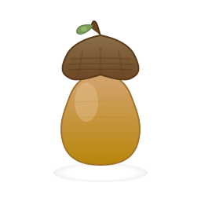

<div align="center">



# Scrat-Backup

**Ein benutzerfreundliches Backup-Programm für Windows-Privatnutzer**

*Wie ein Eichhörnchen seine Eicheln für den Winter sichert, so bewahren wir deine Daten.*

[](https://www.gnu.org/licenses/gpl-3.0)
[](https://www.python.org/downloads/)
[](https://github.com/your-username/scrat-backup)

</div>

---

## 📋 Übersicht

Scrat-Backup ist ein Open-Source-Backup-Tool, das speziell für Privatnutzer entwickelt wurde, die eine einfache und sichere Lösung zum Sichern ihrer persönlichen Daten suchen. Wie ein Eichhörnchen seine Eicheln für den Winter sichert, schützt Scrat-Backup deine wertvollen Daten.

### Hauptfunktionen

- ✅ **Einfache Bedienung**: Windows 11-Stil GUI für intuitive Nutzung
- 🔒 **Verschlüsselung**: AES-256-GCM für maximale Sicherheit (Pflicht)
- 📦 **Inkrementelle Backups**: Nur geänderte Dateien werden gesichert
- 🔄 **Versionierung**: 3 Backup-Versionen werden automatisch verwaltet
- 💾 **Flexible Ziele**: USB, SFTP, WebDAV, Rclone (Cloud-Provider)
- ⏰ **Automatisierung**: Zeitpläne für tägliche/wöchentliche Backups
- 🔍 **Wiederherstellung**: Einzelne Dateien oder komplette Backups
- 🪟 **Windows 10/11**: Optimiert für moderne Windows-Systeme

## 🚀 Status

**Aktuell in Entwicklung - Phase 1 (Projekt-Setup)**

- [x] Architektur definiert
- [x] Projekt-Struktur erstellt
- [ ] Core-Module in Entwicklung
- [ ] GUI in Planung
- [ ] Beta-Version: Q2 2025 (geplant)

## 🛠️ Technologie-Stack

- **Python 3.10+**: Programmiersprache
- **PyQt6**: Moderne GUI
- **SQLite**: Metadaten-Verwaltung
- **AES-256-GCM**: Verschlüsselung
- **7z**: Komprimierung
- **SFTP/WebDAV/Rclone**: Cloud-Backends

## 📦 Installation

**Noch nicht verfügbar - Projekt in Entwicklung**

Geplant für Release 1.0:
```bash
# Windows Installer (.exe)
scrat-backup-setup-1.0.exe

# Oder via pip (geplant)
pip install scrat-backup
```

## 🔧 Entwicklung

### Voraussetzungen

- Python 3.10 oder höher
- Windows 10/11 (Linux-Support geplant)
- Git

### Setup für Entwickler

```bash
# Repository klonen
git clone https://github.com/your-username/scrat-backup.git
cd scrat-backup

# Virtual Environment erstellen
python -m venv venv

# Virtual Environment aktivieren
# Windows:
venv\Scripts\activate
# Linux/Mac:
source venv/bin/activate

# Dependencies installieren
pip install -r requirements.txt

# Tests ausführen
pytest

# Programm starten (wenn implementiert)
python src/main.py
```

### Projektstruktur

```
scrat-backup/
├── src/                 # Quellcode
│   ├── gui/            # GUI-Komponenten
│   ├── core/           # Backup-/Restore-Engine
│   ├── storage/        # Storage-Backends
│   └── utils/          # Hilfsfunktionen
├── tests/              # Unit- und Integrationstests
├── docs/               # Dokumentation
├── assets/             # Icons, Themes
└── installer/          # Build-Skripte
```

## 📖 Dokumentation

- [claude.md](claude.md) - Vollständige Projekt-Dokumentation (Architektur, Entscheidungen)
- [projekt.md](projekt.md) - Implementierungsplan
- User Guide - *Noch nicht verfügbar*
- Developer Guide - *Noch nicht verfügbar*

## 🤝 Beitragen

Contributions sind willkommen! Bitte beachte:

1. Fork das Repository
2. Erstelle einen Feature-Branch (`git checkout -b feature/AmazingFeature`)
3. Committe deine Änderungen (`git commit -m 'Add some AmazingFeature'`)
4. Push zum Branch (`git push origin feature/AmazingFeature`)
5. Öffne einen Pull Request

### Code-Style

- **PEP 8** für Python-Code
- **Type Hints** für alle Funktionen
- **Docstrings** für öffentliche Klassen/Methoden
- **pytest** für Tests (Ziel: >80% Coverage)

## 📄 Lizenz

Dieses Projekt ist unter der **GNU General Public License v3.0** lizenziert.
Siehe [LICENSE](LICENSE) für Details.

### Verwendete Bibliotheken

- PyQt6: Dual License (GPL/Commercial) - Wir nutzen GPL
- py7zr: LGPL
- cryptography: Apache 2.0 / BSD
- paramiko: LGPL
- webdavclient3: MIT

Alle Dependencies sind GPLv3-kompatibel.

## 🔐 Sicherheit

Scrat-Backup nimmt Sicherheit ernst:

- **AES-256-GCM**: Authenticated Encryption für alle Backups
- **PBKDF2**: 100.000 Iterationen für Key-Derivation
- **Kein Plaintext**: Alle sensiblen Daten werden verschlüsselt
- **Optional**: Windows Credential Manager Integration

**Sicherheitslücken melden**: Bitte NICHT als öffentliches Issue, sondern per E-Mail an [security@example.com]

## 🗺️ Roadmap

### Phase 1: Projekt-Setup ✅ (Aktuell)
- [x] Architektur definieren
- [x] Git-Repository initialisieren
- [x] Basis-Struktur anlegen

### Phase 2-5: Core-Entwicklung (Q1 2025)
- [ ] Backup-Engine
- [ ] Restore-Engine
- [ ] Storage-Backends
- [ ] Verschlüsselung

### Phase 6-9: GUI-Entwicklung (Q2 2025)
- [ ] Hauptfenster
- [ ] Wizard
- [ ] Settings
- [ ] Notifications

### Phase 10-12: Release (Q2 2025)
- [ ] Testing
- [ ] Polishing
- [ ] Windows Installer
- [ ] Release 1.0

## 💬 Support

- **Dokumentation**: [claude.md](claude.md)
- **Issues**: [GitHub Issues](https://github.com/your-username/scrat-backup/issues)
- **Diskussionen**: [GitHub Discussions](https://github.com/your-username/scrat-backup/discussions)

## 🙏 Danksagungen

- Inspired by: rsync, duplicati, borg backup
- Icon Design: Eichel 🌰 (ohne Copyright-Probleme)
- Community: Alle zukünftigen Contributors!

## 📊 Projekt-Status


---

**Entwickelt mit ❤️ für die Open-Source-Community**

*Wie ein Eichhörnchen seine Eicheln bewahrt, so bewahren wir deine Daten.*
